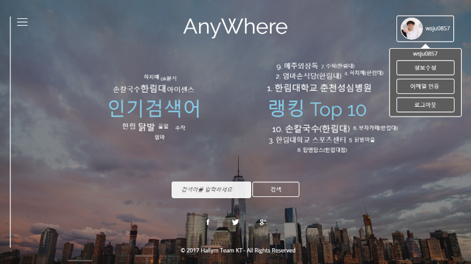
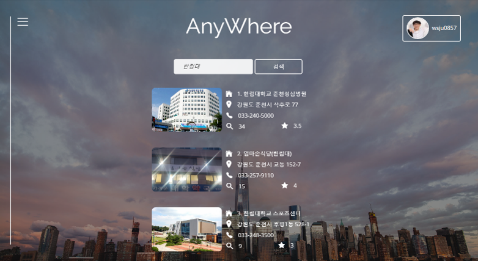
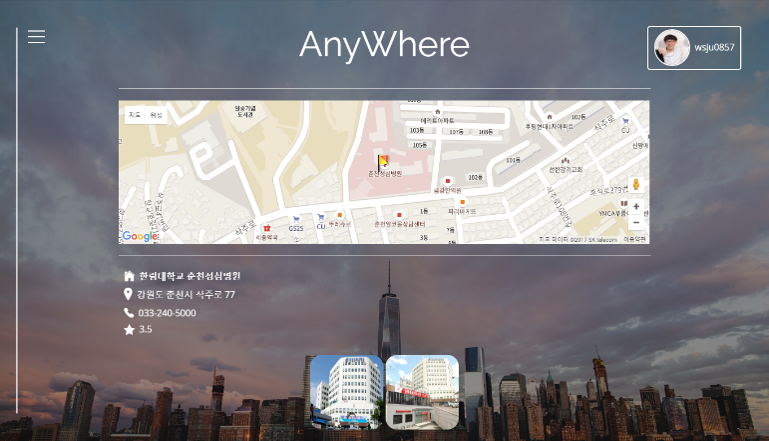
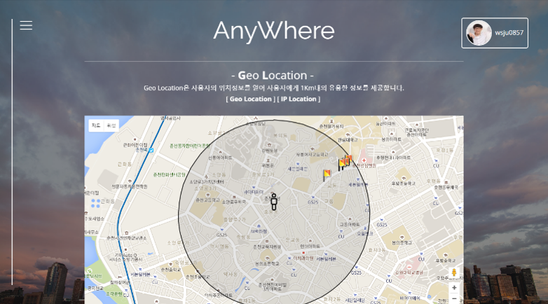

## Anywhere
### 개요
+ 언제 어디서나 주변의 각종 데이터를 확인 할 수 있는 AR 앱과 웹.
### 공헌 내용
+ 4인 팀프로젝트 - 안드로이드(1), 웹(1), 영업(2)
+ 담당 : 웹 개발, 웹 디자인, DB구축 및 관리
+ 닷홈 무료 웹호스팅 이용 FTP 파일 관리
+ 웹 화면 구성 : 템플릿 활용, HTML, CSS, JavaScript
+ 위치 기반 서비스 : Google Map API 제공, Ip API, JavaScript Geolocation 객체 활용 주변 데이터 제공
+ 이메일 인증 서비스 : PHP Mailer 라이브러리 사용
+ 갤러리, 태그 클라우드 등 다양한 플러그인 활용, 네이버 블로그 API 활용 파싱(JSON)
+ 개발Tool : SublimeText3, Filezila, PHPMyadmin
+ 성과 : 교내 LINC사업단 경진대회 은상, 교내 창업동아리 참여, 강원도 대학생 창업 경진대회 참여

### 결과물 사진

&nbsp;
&nbsp;&nbsp;

